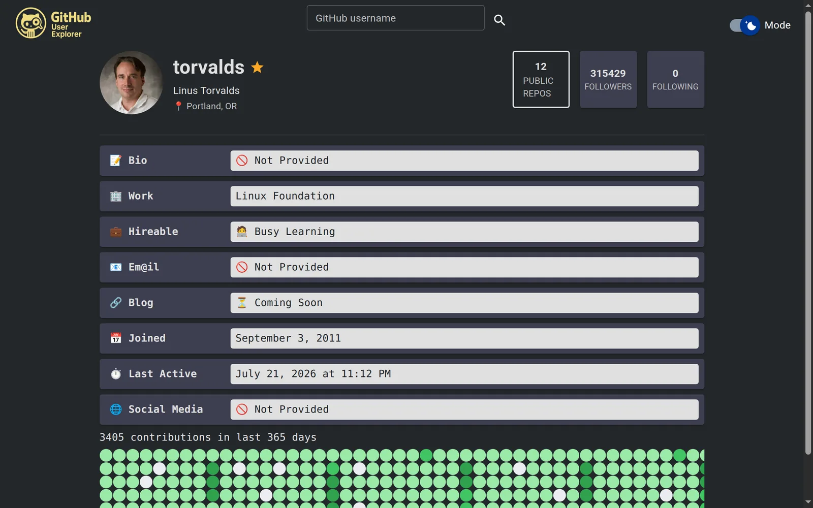
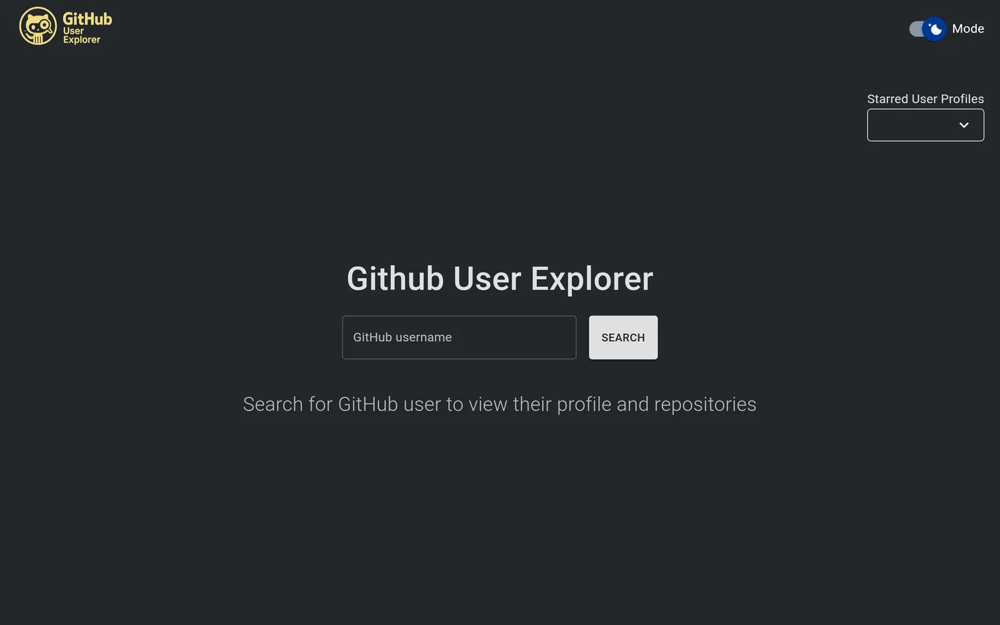
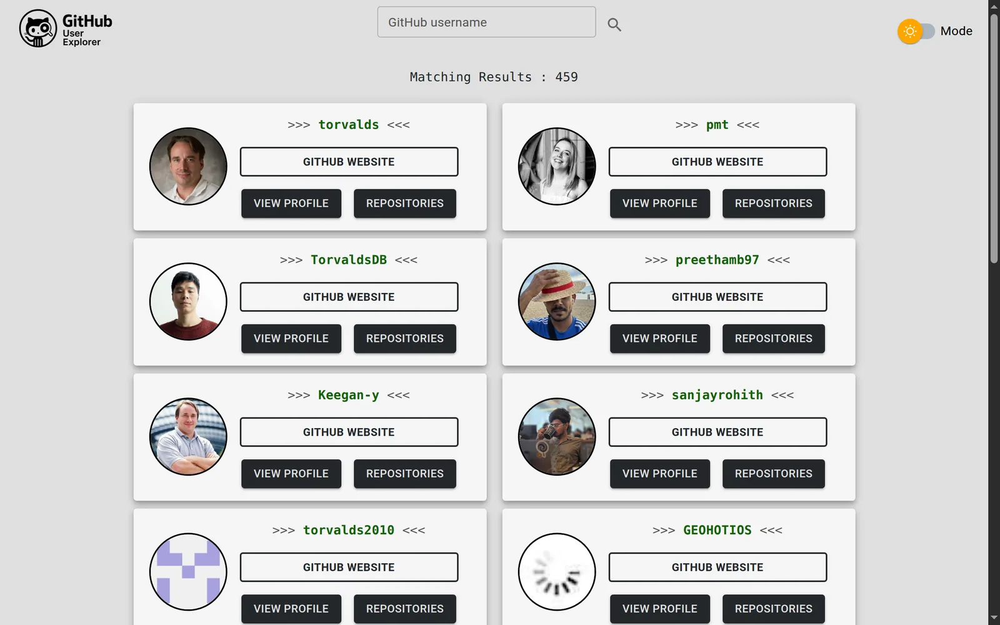
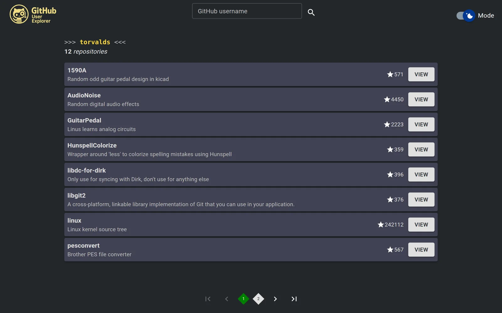
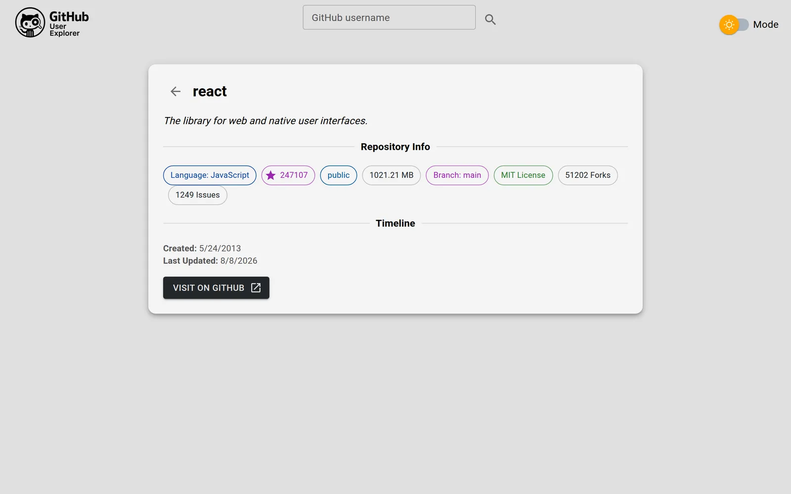

# GitHub User Explorer

Search any GitHub user or organization and explore their profile, repositories
and contribution history.

**🔗 Live demo — <https://github-userexplorer.netlify.app/>**




---

## Features

- **Search from anywhere.** One shared search box on the home page, in the
  navbar of every other route, on the 404 page and on the empty results state —
  so a profile is never a dead end. Below the `sm` breakpoint it collapses to an
  icon that opens a full-width row under the toolbar.
- **Infinite scroll** over search results, driven by an `IntersectionObserver`
  and TanStack Query's `useInfiniteQuery`, with the in-flight guard inside the
  observer callback so fast scrolling cannot stack requests.
- **Contribution calendar** — the 365-day grid from GitHub's GraphQL API, which
  is the only place it is exposed. Each cell carries its date and count as a
  tooltip and as an accessible name.
- **User vs. organization detection**, so an organization renders its top
  repositories instead of a personal profile.
- **Paginated repository browser** with a detail page per repository —
  language, size, licence, default branch, stars, forks and issues.
- **Starred profiles**, kept in `localStorage` and validated on the way back
  out, reachable from a dropdown on the home page.
- **Light and dark themes** with a custom animated switch; a first-time visitor
  gets their system preference.
- **Responsive** from 375 px up, verified at both ends.

|                                                        |                                                         |
| ------------------------------------------------------ | ------------------------------------------------------- |
|                     |         |
|  |  |

---

## Tech stack

| Tool                          | Why                                                                                                                                                      |
| ----------------------------- | -------------------------------------------------------------------------------------------------------------------------------------------------------- |
| **React 19** + **TypeScript** | `strict` is on, and every API payload is typed from a schema rather than asserted                                                                        |
| **TanStack Query v5**         | Caching, retry policy and pagination in one place. The retry predicate refuses to retry a rate limit or a 404 — retrying either only makes it worse      |
| **MUI v7** + Emotion          | Component library with theming; the animated theme switch is custom                                                                                      |
| **React Router v7**           | Client-side routing, with the non-home routes lazily loaded                                                                                              |
| **Vite 6** + SWC              | Fast dev server, and the build that splits each route into its own chunk                                                                                 |
| **Zod**                       | The GitHub payloads are validated at the fetch boundary and the TypeScript types are inferred from those schemas, so the type and the check cannot drift |
| **Netlify Functions**         | A small server-side proxy. GitHub's GraphQL API needs a token, and a browser cannot hold a secret — see below                                            |
| **Vitest**                    | Unit tests over the pure logic: URL building, pagination arithmetic, login validation, storage parsing                                                   |

---

## Architecture

```
client/src/
  page/        route components
  components/  presentational + shared UI (SearchBar, ErrorState, EmptyState…)
  hooks/       one hook per API resource, all thin wrappers over useQuery
  helper/      pure logic: URL building, pagination, validation, storage
  constants/   Zod schemas, query keys, shared types
  context/     theme mode and starred profiles
  theme/       MUI theme factory
netlify/functions/
  one file per endpoint, sharing a proxy module — the only place the token exists
```

**The token lives on the server, and that is the one architectural decision
worth explaining.** The contribution graph comes from GitHub's GraphQL API,
which requires authentication. A `VITE_`-prefixed variable is inlined into the
JavaScript bundle by Vite, which means shipping the credential to every
visitor — there is no way to hide a secret in a browser. So the browser calls
this site's own `/api/*`, seven Netlify Functions call GitHub with the token,
and the bundle contains no credential and no `api.github.com` reference at all.
The proxy also validates every parameter, forwards GitHub's rate-limit headers
so the client can tell a 403 apart from a real error, and never forwards an
upstream error body.

---

## Getting started

```bash
git clone https://github.com/s3nsh1-dev/github-user-explorer.git
cd github-user-explorer/client
npm install
```

Create a `.env.development` in the **repo root** (see `.env.example`) with a
GitHub token — no scopes required, public data needs none:

```
GITHUB_TOKEN=your_token_here
```

Then, from the repo root:

```bash
npx netlify dev      # serves the app and the functions together on :8888
```

`npm run dev` inside `client/` also works and proxies `/api` to `netlify dev`,
but the functions have to be running for anything to load.

| Script                        |                                                 |
| ----------------------------- | ----------------------------------------------- |
| `npm run dev`                 | Vite dev server                                 |
| `npm run build`               | Type-check and build                            |
| `npm run test:run`            | Unit tests, once                                |
| `npm run lint`                | ESLint, including `jsx-a11y`                    |
| `npm run typecheck:functions` | The Netlify functions are a separate TS project |

---

## Trade-offs and what I would do differently

- **No live search suggestions.** Search fires on submit. Suggestions-as-you-type
  would need a debounced query against GitHub's tightest endpoint — 30 searches
  per minute — and the app shares one token across all visitors, so the ceiling
  is shared too. Submit-only is the better design here, not a shortcut.
- **Followers and following are numbers, not links.** A followers list needs its
  own paginated screen and its own requests. It is a feature, not a fix, so it
  is not pretended at: those two cards are plainly data rather than buttons that
  do nothing.
- **The contribution grid shows no numbers in its cells.** GitHub's colour ramp
  runs from near-white to dark green, and no single text colour is readable
  across all of it. The count is a tooltip and an accessible name instead —
  which is also what GitHub does.
- **Cross-tab starring does not sync.** Storage is read once at startup rather
  than on every navigation. A `storage` event listener would fix it; it has not
  been worth the complexity yet.
- **Unit tests cover the pure logic only.** No component or end-to-end tests.
  The pure functions are where the real bugs were — a pagination `NaN` and an
  unencoded URL — and component tests would be brittle while the UI is still
  moving.

---

## Project history

[`docs/PROJECT_LOG.md`](docs/PROJECT_LOG.md) is the original planning file, kept
verbatim: the task list this was built against, in the order it was worked, down
to the last line — `PROJECT COMPLETED`. Three items on it — infinite scroll, a
search box inside the profile view, and the starred-profiles dropdown — are
finished and listed under Features above. [`docs/design/`](docs/design/) holds
the early mockups, and [`docs/screenshots/`](docs/screenshots/) the captures
above.

## Licence

MIT — see [LICENSE](LICENSE).
